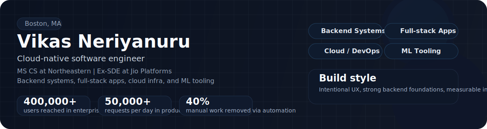

  

  <a href="https://vikasneriyanuru.com">Portfolio</a>
  ·
  <a href="https://www.linkedin.com/in/vikas-neriyanuru">LinkedIn</a>
  ·
  <a href="mailto:neriyanuru.v@northeastern.edu">Email</a>

## Snapshot

I build software that has to look intentional, behave predictably, and hold up under real usage. My background sits at the intersection of backend systems, product engineering, cloud infrastructure, and ML-powered tooling.

<table>
  <tr>
    <td width="25%" valign="top">
      <strong>400,000+</strong> 
      employees served through enterprise platforms
    </td>
    <td width="25%" valign="top">
      <strong>50,000+</strong> 
      requests per day across production services
    </td>
    <td width="25%" valign="top">
      <strong>40%</strong> 
      reduction in manual processing via automation
    </td>
    <td width="25%" valign="top">
      <strong>100+</strong> 
      code reviews focused on quality and performance
    </td>
  </tr>
</table>

## What I Build

<table>
  <tr>
    <td width="50%" valign="top">

### Systems

- REST services and backend workflows
- Cloud-native application infrastructure
- CI/CD and developer-facing engineering tools
- Data-backed product features and platform services

    </td>
    <td width="50%" valign="top">

### Product Style

- Strong backend foundations
- Clear user-facing behavior
- Measurable performance improvements
- Production-minded implementation over demo-only polish

    </td>
  </tr>
</table>

## Featured Projects

| Project | Why it matters | Stack |
| --- | --- | --- |
| [Resolution-Pulse](https://github.com/VIKAS0804/Resolution-Pulse) | AI life coach that combines bio-aware planning, goal tracking, and LLM-powered nudges into a day-to-day execution system. | `Next.js` `TypeScript` `Claude API` |
| [vikas-portfolio](https://github.com/VIKAS0804/vikas-portfolio) | Interactive Windows XP-inspired portfolio that turns a personal site into a product experience instead of a generic landing page. | `Next.js 15` `Tailwind CSS` `Radix UI` |
| [kambaz-next-js1](https://github.com/VIKAS0804/kambaz-next-js1) | Canvas-style LMS frontend with dashboards, modules, assignments, grades, quizzes, and account flows. | `Next.js` `React` `TypeScript` `Bootstrap` |
| [kambaz-node-server-app](https://github.com/VIKAS0804/kambaz-node-server-app) | Express backend for the Kambaz LMS with organized route modules for users, courses, assignments, modules, and enrollments. | `Node.js` `Express` `REST API` |
| [mlops-lab6-fastapi-wine-api](https://github.com/VIKAS0804/mlops-lab6-fastapi-wine-api) | FastAPI-based ML service with reproducible training, model metadata endpoints, and automated API validation. | `Python` `FastAPI` `scikit-learn` |

## Toolbox

**Languages**  
`Java` `Python` `C/C++` `JavaScript` `TypeScript` `SQL` `Bash`

**Frameworks and Runtime**  
`React` `Next.js` `Node.js` `Express` `Spring Boot` `Flask` `Django`

**Cloud and DevOps**  
`AWS` `Docker` `Kubernetes` `GitHub Actions` `Jenkins` `CloudWatch` `CI/CD`

**Data and Storage**  
`MySQL` `PostgreSQL` `MongoDB` `Redis` `Pandas` `NumPy` `scikit-learn`

## Right Now

- MS in Computer Science at Northeastern University
- Going deeper on distributed systems, cloud architecture, and platform engineering
- Building projects that are both technically solid and easy to understand quickly

## Reach Out

If you are building in backend, cloud, full-stack product engineering, or applied AI tooling, I am always happy to connect.
