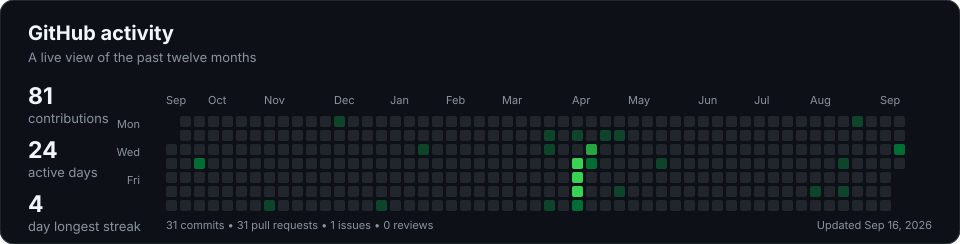

<h1 align="center">Hi, I'm Vikas 👋</h1>

  Software Developer Intern at Superstars &nbsp;•&nbsp; Graduate Teaching Assistant at Khoury College 
  MS in Computer Science at Northeastern &nbsp;•&nbsp; Previously a Software Development Engineer at Jio Platforms

  <a href="https://vikasneriyanuru.com">Portfolio</a> &nbsp;•&nbsp;
  <a href="https://www.linkedin.com/in/vikas-neriyanuru">LinkedIn</a> &nbsp;•&nbsp;
  <a href="mailto:neriyanuru.v@northeastern.edu">Email</a>

## About me

Most of my work sits somewhere between backend systems, cloud infrastructure, machine learning, and the product experience people actually see. I enjoy following a problem all the way from the data model and deployment pipeline to the final screen.

Right now I build product features at Superstars and support more than 60 students as a Graduate Teaching Assistant at Northeastern. Before graduate school, I worked at Jio Platforms on internal systems used by more than 400,000 employees and backend services handling over 50,000 requests each day.

I like projects that have a real technical question at the center. When I put something on GitHub, I want another engineer to understand why it exists, run it without guessing, and see the tradeoffs behind the decisions.

## Projects I have enjoyed building

### [MoodSync](https://github.com/VIKAS0804/Moodsync)

A mood controlled music experience for Spotify libraries. Spotify no longer gives new apps access to audio features, so I built the scoring pipeline myself with preview audio, local signal processing, and a calibrated model. It reached a Spearman correlation of 0.82 and analyzed 46 of 50 tracks in the evaluation library.

`FastAPI` `React Native` `PostgreSQL` `librosa`

### [TicketForge](https://github.com/ALearningCurve/ticket-forge)

An MLOps platform that recommends the right engineer for a ticket using skills, history, and ticket context. I contributed 30 merged pull requests across data ingestion, training, model serving, monitoring, deployment, and infrastructure. Our team placed third at Northeastern's MLOps Expo and presented the system at Google Cambridge.

`Python` `FastAPI` `Airflow` `MLflow` `GCP` `Terraform`

### [ThinkStruct Patent Search](https://github.com/VIKAS0804/ThinkStruct-assessment)

A hybrid search engine for 640 patents with patent, claim, and paragraph retrieval. It combines dense search with reciprocal rank fusion and includes a training pipeline that improved held out AUC from 0.80 to 0.95. The repository also contains a pgvector design for more than ten million patents and a suite of 153 tests.

`Python` `Flask` `sentence transformers` `pgvector`

### [Impulse Coach](https://github.com/VIKAS0804/fintech-coach-app)

A mobile fintech coach that looks for impulse spending patterns in Plaid transactions and turns them into useful prompts. Supabase handles authentication, Edge Functions, and PostgreSQL Row Level Security so every financial record stays scoped to its owner.

`Expo` `TypeScript` `Supabase` `Plaid` `PostgreSQL`

### [Personal IoT Sensor Dashboard](https://github.com/VIKAS0804/personal-iot-sensor-dashboard)

A shipment condition monitor built around secure MQTT. The React Native app receives live temperature and humidity readings, then a Cloud Run service writes them to Firestore and publishes events through Pub/Sub.

`React Native` `MQTT` `Node.js` `Cloud Run` `Firestore`

### [Tribunal](https://github.com/VIKAS0804/Zoro)

A Bitcoin native marketplace for AI agents, built at the MIT Bitcoin Hackathon. Payments use three HTLC locks, reputation comes from on chain outcomes, and disputed work goes through commit and reveal voting by a staked jury.

`Next.js` `TypeScript` `Bitcoin Script` `PostgreSQL`

## What I work with

Java and Python are the languages I reach for most often on the backend. I also work comfortably with TypeScript, Go, SQL, Spring Boot, FastAPI, React, Next.js, React Native, and Expo.

For infrastructure and data work, I use AWS, GCP, Docker, Kubernetes, Terraform, GitHub Actions, PostgreSQL, MongoDB, and Redis. My machine learning work has included PyTorch, scikit learn, MLflow, Airflow, semantic retrieval, and vector databases.

## GitHub activity

  

This snapshot is generated directly from GitHub's API and stored in this repository, so it does not depend on an external card service. A bot refreshes the image each day, but those refreshes are not counted as my contributions.

## Say hello

I am always happy to talk about backend engineering, cloud systems, full stack products, MLOps, or an interesting problem that does not fit neatly into one category. You can find me on [LinkedIn](https://www.linkedin.com/in/vikas-neriyanuru) or reach me by [email](mailto:neriyanuru.v@northeastern.edu).
